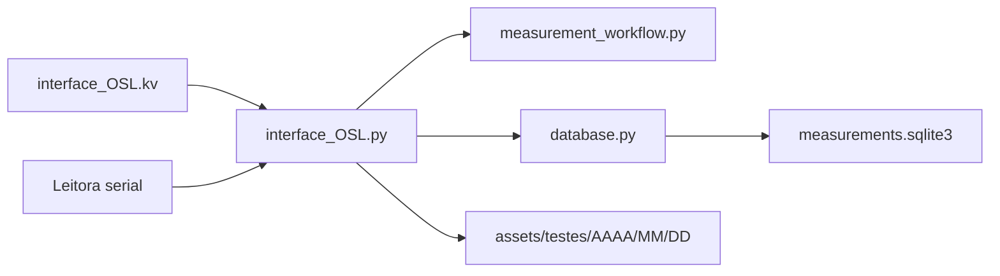

# OSLMeter V4.0

Aplicação desktop em **Python + Kivy** para controlar uma leitora OSL
(*Optically Stimulated Luminescence*) pela porta serial, calcular doses e
manter um histórico auditável em **SQLite**.

O sistema trabalha em dois modos:

- **Manual**: o operador informa ECC, RCF, Fang, Fenerg, Linha de Base e o nome
  do arquivo.
- **Dosímetro ID**: o dosímetro e a leitora são consultados no banco. Cada
  teste reúne uma aquisição de **Hp(10)** e outra de **Hp(0,07)**.

## Funcionalidades

- Comunicação serial a `115200 baud`.
- Start, Stop, Erase, Ref Light e configuração da leitora.
- Leitura de código de barras de 10 dígitos.
- Grandezas Hp(10) e Hp(0,07), com ECC e BC próprios para cada uma.
- RCF carregado do cadastro da leitora.
- Integral da Área e Linha de Base consolidados após as duas grandezas.
- Cadastro, pesquisa, edição, ativação e exclusão de dosímetros e leitoras.
- Preenchimento automático dos formulários ao informar um ID existente.
- Validação de estado ativo e período de validade antes da aquisição.
- Histórico detalhado das aquisições e dos parâmetros realmente aplicados.
- Exportação CSV, backup e importação segura do banco SQLite.
- Arquivos técnicos `.txt` separados por ano, mês e dia.
- Gráfico em tempo real e visualização de logs antigos.
- Simulador para desenvolvimento sem o equipamento físico.
- Empacotamento para Windows com PyInstaller.

## Requisitos

- Python 3.11 ou superior.
- Kivy 2.3.1.
- pyserial 3.5.
- matplotlib 3.9.2.
- pandas 3.0.5.

O módulo `sqlite3` já faz parte da biblioteca padrão do Python.

## Instalação e execução

No PowerShell:

```powershell
git clone https://github.com/azieldefontesmelo/Interface_Leitora.git
cd Interface_Leitora\Interface_Leitora

python -m venv .venv
.\.venv\Scripts\Activate.ps1
pip install -r requirements.txt
python interface_OSL.py
```

No Linux ou macOS, ative o ambiente com:

```bash
source .venv/bin/activate
```

## Modos de leitura

### Manual

O operador informa:

| Campo | Função |
|---|---|
| `ECC` | fator individual do dosímetro |
| `RCF` | fator da leitora |
| `Fang` | fator angular |
| `Fenerg` | fator de energia |
| `Base Line` | valor subtraído da soma |
| `File Name` | nome do arquivo `.txt` |

ECC, RCF, Fang e Fenerg devem ser maiores que zero. A Linha de Base deve ser
numérica e não negativa.

### Dosímetro ID

O operador seleciona uma leitora e informa ou lê o código de barras do
dosímetro. O sistema valida automaticamente:

- ID com exatamente 10 dígitos;
- dosímetro cadastrado, ativo e dentro da validade;
- leitora cadastrada, ativa e dentro da validade;
- ECC da grandeza selecionada maior que zero;
- RCF da leitora maior que zero.

Os parâmetros vêm destes cadastros:

| Grandeza | ECC aplicado | Linha de Base aplicada | RCF aplicado |
|---|---|---|---|
| Hp(10) | `dosimeters.ecc_hp10` | `dosimeters.bc_hp10` | `readers.rcf` |
| Hp(0,07) | `dosimeters.ecc_hp007` | `dosimeters.bc_hp007` | `readers.rcf` |

Ao trocar a grandeza, a interface carrega a constante correspondente do banco.
ECC, BC e RCF utilizados também são copiados para a medição, preservando o
histórico mesmo que o cadastro seja alterado posteriormente.

### Sessão Hp(10) + Hp(0,07)

Cada teste de dosímetro possui um `test_session_id` e só termina quando as duas
grandezas forem concluídas:

1. O operador escolhe Hp(10) ou Hp(0,07) e inicia a aquisição.
2. Durante a aquisição, a interface mostra `Lendo Hp(10)...` ou
   `Lendo Hp(0,07)...`.
3. O botão da grandeza só comuta depois do término real da leitura.
4. Stop, erro ou interrupção não concluem a grandeza; o operador deve repeti-la.
5. Depois das duas aquisições concluídas, o banco cria um único registro
   consolidado para a sessão.

O nome automático contém tipo, grandeza, data, hora e microssegundos:

```text
<dosimetro>_<integral-ou-linha-base>_<hp10-ou-hp007>_<data_hora>.txt
```

## Integral da Área e Linha de Base

Uma sessão normal é registrada em `historico_dose` como **Integral da Área**.

Para registrar em `historico_branco` como **Linha de Base**, o operador precisa
executar **Erase** antes de iniciar a primeira leitura da sessão. O zeramento
classifica o par Hp(10)/Hp(0,07) como `BACKGROUND`. Depois que ambas terminam,
o fluxo volta ao tipo normal `PERSONAL_DOSE`.

Executar Stop não transforma uma sessão em Linha de Base e não comuta a
grandeza; apenas marca a aquisição como interrompida.

## Cálculo da dose

A fórmula é:

```text
Dose = max(0, (Soma - Linha de Base) × RCF × ECC × Fang × Fenerg)
```

No modo Manual, os fatores vêm dos campos da interface. No modo Dosímetro ID,
ECC e Linha de Base vêm do canal selecionado no cadastro do dosímetro, e RCF
vem da leitora. A medição armazena snapshots de todos esses parâmetros.

## Banco de dados SQLite

O banco é criado automaticamente em:

```text
Interface_Leitora/assets/database/measurements.sqlite3
```

O esquema atual é a **versão 6**. A inicialização executa migrações compatíveis
com bancos anteriores e registra a versão em `PRAGMA user_version` e
`schema_versions`.

Cada conexão usa:

- `PRAGMA foreign_keys = ON`;
- `PRAGMA journal_mode = WAL`;
- `PRAGMA busy_timeout = 10000`;
- commit ao concluir a operação;
- rollback automático quando ocorre uma exceção.

### Estrutura das tabelas

#### `dosimeters`

| Coluna | Conteúdo |
|---|---|
| `dosimeter_id` | chave primária textual com exatamente 10 dígitos |
| `ecc_hp10` | ECC de Hp(10) |
| `ecc_hp007` | ECC de Hp(0,07) |
| `bc_hp10` | BC/Linha de Base de Hp(10) |
| `bc_hp007` | BC/Linha de Base de Hp(0,07) |
| `begin_date`, `end_date` | período de validade; data final opcional |
| `active` | `1` ativo ou `0` inativo |
| `created_at`, `updated_at` | auditoria em UTC |

#### `readers`

| Coluna | Conteúdo |
|---|---|
| `reader_id` | chave primária textual da leitora |
| `rcf` | constante RCF maior que zero |
| `begin_date`, `end_date` | período de validade; data final opcional |
| `active` | `1` ativa ou `0` inativa |
| `created_at`, `updated_at` | auditoria em UTC |

#### `measurements`

Cada linha representa uma aquisição individual. Uma sessão completa de
dosímetro normalmente gera duas linhas, uma para cada canal.

Entre os dados gravados estão:

- `test_mode`: `MANUAL` ou `DOSIMETER_ID`;
- `reading_type`: `PERSONAL_DOSE` ou `BACKGROUND`;
- `dose_channel`: `HP10` ou `HP007`;
- `test_session_id`: vínculo entre as duas grandezas;
- leitora, dosímetro, data/hora e arquivo;
- Count, Current, Light, sinal bruto e dose;
- ECC, RCF, Fang, Fenerg e Linha de Base aplicados;
- status `EM_ANDAMENTO`, `CONCLUIDO`, `INTERROMPIDO` ou `ERRO`;
- observações e datas de auditoria.

#### `historico_dose`

Guarda o resultado consolidado da sessão de Integral da Área. O registro só é
criado quando existem aquisições `CONCLUIDO` para HP10 e HP007 na mesma sessão.
Mantém os dois valores, os IDs das duas medições e o status `Need to Erase`.

#### `historico_branco`

Guarda o resultado consolidado da sessão iniciada após Erase. Também exige as
duas grandezas concluídas e usa o status `Ready to Use`.

### Integridade e relacionamentos

- IDs são armazenados como texto, preservando zeros à esquerda.
- Datas de persistência são normalizadas para ISO 8601/UTC.
- SQL usa parâmetros, sem interpolar valores fornecidos pelo operador.
- Alterar o ID de dosímetro ou leitora atualiza as referências com
  `ON UPDATE CASCADE`.
- A exclusão pela interface pede confirmação e remove, em uma transação, os
  históricos e medições vinculados antes do cadastro.
- Exclusões são bloqueadas enquanto houver uma leitura em andamento.

## Integração do banco com os arquivos Python

### `database.py`

É a camada de persistência. Ela concentra:

- criação e migração do esquema;
- normalização e validação de IDs, datas e números;
- CRUD de dosímetros e leitoras;
- início e atualização das medições;
- consolidação de Hp(10)/Hp(0,07) por `sync_measurement_history()`;
- consultas, filtros e exportação CSV;
- backup, validação e importação do SQLite.

A interface não executa SQL diretamente. Ela chama os métodos da classe
`Database`.

### `interface_OSL.py`

Na inicialização, `AplicativoInterfaceOSL.build()` cria uma única instância de
`Database` e a injeta nas telas principal e de banco de dados:

```python
self.database = Database()
root.get_screen("main").database = self.database
root.get_screen("banco_dados").database = self.database
```

O fluxo de aquisição é:

1. Consulta e valida dosímetro e leitora no banco.
2. Carrega ECC/BC do canal e RCF da leitora.
3. Cria a medição com status `EM_ANDAMENTO`.
4. Recebe os frames da serial e calcula a dose.
5. Atualiza a medição como `CONCLUIDO`, `INTERROMPIDO` ou `ERRO`.
6. Chama `sync_measurement_history()` após uma conclusão.
7. O histórico consolidado aparece somente quando a sessão possui HP10 e HP007.

A tela Banco de dados usa a mesma instância para cadastrar, pesquisar, editar,
ativar, desativar e excluir registros.

### `measurement_workflow.py`

Contém regras independentes da interface:

- limpeza do texto recebido pelo leitor de código de barras;
- validação e criação segura dos nomes de arquivo;
- conversão de números com ponto ou vírgula decimal;
- fórmula de cálculo da dose.

### `interface_OSL.kv`

Define os campos, botões e estados visuais. Os eventos de Enter, perda de foco,
Salvar, Excluir e seleção de grandeza chamam os métodos de `interface_OSL.py`,
que por sua vez acessam `Database`.



## Cadastros na interface

### Dosímetros

- Informar um ID existente e pressionar Enter ou sair do campo preenche ECC
  Hp(10), ECC Hp(0,07), BC Hp(10), BC Hp(0,07), datas e status.
- **Salvar** cadastra ou atualiza todos os campos, inclusive o ID.
- **Ativar/Desativar** controla a disponibilidade para novas leituras.
- **Excluir** pede confirmação e remove os dados vinculados.

### Leitoras

- Informar um Reader existente e pressionar Enter ou sair do campo preenche
  RCF, datas e status.
- **Salvar** cadastra ou atualiza todos os campos, inclusive o Reader.
- **Ativar/Desativar** controla a disponibilidade.
- **Excluir** pede confirmação e remove medições e históricos vinculados.

As datas são digitadas manualmente. A interface não insere barras
automaticamente; aceita `dd/mm/aaaa`, e a data final é opcional.

## CSV, backup e importação

- Integral da Área, Linha de Base e medições podem ser exportados em CSV
  `UTF-8 com BOM`.
- O backup usa `sqlite3.Connection.backup()` e valida o resultado com
  `PRAGMA integrity_check`.
- A importação valida tabelas, integridade e chaves estrangeiras, migra o
  esquema quando necessário e cria um backup automático antes da substituição.
- Se a importação falhar, o banco anterior é restaurado.

## Arquivos de medição

Os arquivos são gravados em:

```text
Interface_Leitora/assets/testes/AAAA/MM/DD/<nome>.txt
```

Formato básico:

```text
30/07/2026 15:30:00
exemplo.txt
Soma: 3469
Dose: 0.114
Time;Count;Current;Light
0.1;1733;45;471
```

O arquivo é criado em modo exclusivo e nunca sobrescreve silenciosamente um
arquivo existente.

## Simulador sem hardware

O simulador usa por padrão a porta `COM6`. Com um par virtual `COM5 ↔ COM6`:

1. Execute `simulacao\rodar_simulador.bat`.
2. Abra a interface e selecione `COM5`.
3. Clique em **Connect** e depois em **Start**.

Para outro par, altere `PORTA_SERIAL` em `simulacao/simulador_osl.py`.

## Estrutura do projeto

```text
Interface_Leitora/
├── interface_OSL.py
├── interface_OSL.kv
├── database.py
├── measurement_workflow.py
├── Plot_grafico.py
├── OSLMeter.spec
├── requirements.txt
├── conversor/
├── simulacao/
├── tests/
└── assets/
    ├── database/
    ├── backups/
    ├── exports/
    ├── log/
    └── testes/AAAA/MM/DD/
```

## Testes

Os testes usam bancos e diretórios temporários, sem alterar o banco real:

```powershell
cd Interface_Leitora
python -m unittest discover -s tests -v
```

A suíte cobre migração e integridade do esquema, CRUD, renomeação em cascata,
exclusão com dados vinculados, validade, snapshots dos parâmetros, sessões de
duas grandezas, Linha de Base após Erase, Stop, CSV, backup, importação e fluxo
visual da interface.

## Empacotamento

```powershell
cd Interface_Leitora
pyinstaller OSLMeter.spec
```

O arquivo `.spec` inclui o layout Kivy e os assets necessários. No executável,
os caminhos são resolvidos a partir de `sys._MEIPASS`.
