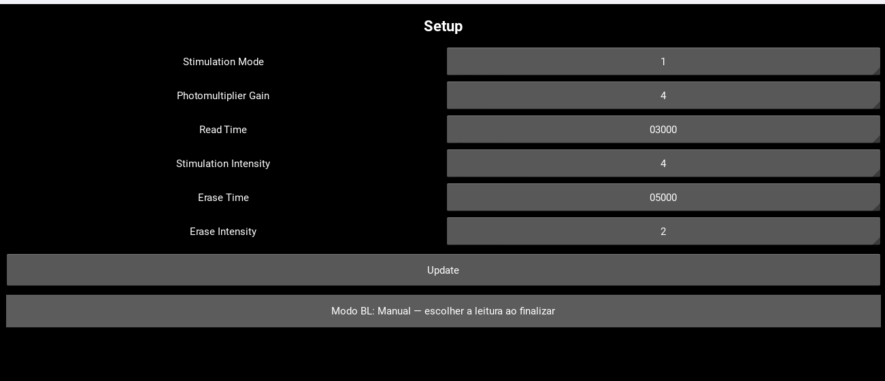

# Planejamento — tratamento de alta dose

**Status:** fechado para implementação — versão 1.0 — 15/09/2026.

Este documento define o comportamento do supervisório, os critérios de
persistência e a validação necessária. A confirmação das portas físicas e a
execução com hardware continuam sendo etapas de validação, não decisões de
projeto.

## 1. Objetivo

Adaptar somente o programa supervisório para reconhecer uma indicação de saturação, orientar o operador a ajustar manualmente o filtro e reiniciar a leitura com uma configuração de LED reduzida.

O firmware do microcontrolador/controlador não deverá ser alterado neste trabalho.

## 2. Requisitos funcionais

1. Ao receber a string de saturação:

   ```text
   #L1%AsatLeit&
   ```

   o programa supervisório deverá:

   - marcar a leitura atual como leitura de alta dose;
   - enviar, antes da abertura do popup, a configuração:

     ```text
     #S1%M1G3L03000P1Z01000Q4&
     ```

   - aguardar a conclusão do envio pela porta serial;
   - mostrar um popup informando que foi detectada alta dose;
   - instruir o operador a ajustar manualmente o filtro;
   - aguardar o acionamento de `OK`.

2. O microcontrolador interrompe a leitura ao detectar a saturação. O programa supervisório não deverá enviar um comando de parada adicional nessa etapa.

3. Ao pressionar `OK` no popup:

   - considerar que o operador ajustou o filtro;
   - reiniciar a leitura usando o fluxo normal já existente;
   - manter o modo de alta dose ativo para o cálculo daquela leitura reiniciada.

4. Em alta dose, calcular:

   ```text
   dose = |(soma * fLed) - linha_de_base| × RCF × ECC × Fang × Fenerg
   ```

5. Fora do modo de alta dose, o cálculo atual da dose deverá permanecer inalterado.

6. Na tela de configuração, exibir `fLed` ao lado de `PLed`, permitindo edição manual e persistência dos valores.

## 3. Texto sugerido para o popup

| Elemento | Texto |
|---|---|
| Título | `Alta dose detectada` |
| Mensagem | `A leitura está indicando alta dose. Ajuste manualmente o filtro antes de continuar.` |
| Orientação adicional | `Após ajustar o filtro, pressione OK para reiniciar a leitura.` |
| Botão | `OK` |

O popup deverá ser modal para impedir que o operador altere outros parâmetros ou inicie uma segunda leitura enquanto a condição de saturação estiver pendente.

## 4. Sequência operacional planejada

```text
Leitura normal
      |
      | recebe #L1%AsatLeit&
      v
Marcar alta dose
      |
      | enviar #S1%M1G3L03000P1Z01000Q4&
      v
Confirmar envio serial
      |
      v
Exibir popup e bloquear a tela
      |
      | operador ajusta manualmente o filtro e pressiona OK
      v
Enviar comando de início pelo fluxo existente
      |
      v
Reiniciar leitura em modo de alta dose
      |
      v
Calcular com |(soma * fLed) - linha_de_base| × RCF × ECC × Fang × Fenerg
```

### Ordem obrigatória

O evento de saturação deve ser processado nesta ordem:

1. Receber e validar a string completa, incluindo `&`.
2. Travar o evento para não abrir popups duplicados.
3. Trocar o estado interno para `ALTA_DOSE_AGUARDANDO_FILTRO`.
4. Enviar a configuração com `P1`.
5. Confirmar que os bytes foram entregues à camada serial.
6. Abrir o popup.

O popup nunca deverá aparecer antes do envio da configuração de `P1`.

## 5. Protocolo serial

### 5.1 Configuração enviada após saturação

```text
#S1%M1G3L03000P1Z01000Q4&
```

O campo relevante é `P1`, que reduz a potência do LED para o procedimento de alta dose.

### 5.2 Reinício após `OK`

O reinício deverá reutilizar o comando de início já implementado no
supervisório, sem criar um comando novo no controlador. No código atual, o
comando existente é:

```text
#S1%SC1001&
```

`#S1%C0001&` não faz parte do comando de início ativo e não deverá ser
introduzido como substituto.

O envio só deve ocorrer depois do `OK` e depois de o estado pendente de alta dose estar confirmado.

### 5.3 Controle contra duplicidade

Enquanto o popup estiver aberto ou a leitura estiver aguardando reinício:

- novas ocorrências de `#L1%AsatLeit&` deverão ser registradas no log, mas não deverão abrir outro popup;
- o programa não deverá reenviar a configuração repetidamente;
- o botão `OK` deverá ser protegido contra duplo acionamento;
- a transição para leitura reiniciada deverá ocorrer uma única vez.

## 6. Regra obrigatória do gatilho de saturação

O único gatilho aceito pelo programa supervisório deverá ser exatamente:

```text
#L1%AsatLeit&
```

A comparação deverá considerar o pacote completo, incluindo `#`, maiúsculas/minúsculas e o terminador `&`.

No firmware analisado, essa string exata não aparece como envio ativo; portanto, a simulação deverá fornecê-la explicitamente para validar o fluxo. Não deverá ser criada uma conversão automática nem um alias para os indicadores abaixo.

O firmware contém, em código ativo, os seguintes indicadores específicos:

| String atual | Origem no firmware | Interpretação |
|---|---|---|
| `#L1%VsatLeit&` | `exibir_VPMT` | Indicador alternativo; não dispara alta dose |
| `#L1%EsatLeit&` | `exibir_corrente_LED_leit` | Indicador alternativo; não dispara alta dose |
| `#L1%FsatLeit&` | `exibir_corrente_LED_zeramento` | Indicador alternativo; não dispara alta dose |
| `#L1%LsatLeit&` | `exibir_luz_referencia` | Indicador alternativo; não dispara alta dose |

Também há `#S1%IsatLeit&` em comentários, mas ela não é enviada pelo código ativo e não deverá ser aceita como substituta.

## 7. Modelo de estados do supervisório

| Estado | Descrição | Eventos permitidos |
|---|---|---|
| `LEITURA_NORMAL` | Cálculo original ativo | Dados normais, fim da leitura, saturação |
| `ALTA_DOSE_ENVIANDO_CONFIG` | Saturação reconhecida; enviando configuração `P1` | Conclusão/erro do envio |
| `ALTA_DOSE_AGUARDANDO_FILTRO` | Popup aberto e leitura interrompida | Somente `OK` |
| `ALTA_DOSE_REINICIANDO` | Comando de início sendo enviado | Confirmação do início ou timeout |
| `LEITURA_ALTA_DOSE` | Leitura reiniciada com fórmula especial | Dados, fim da leitura, nova saturação |
| `LEITURA_FINALIZADA` | Ciclo terminado | Retorno ao estado normal conforme regra atual |

O estado `ALTA_DOSE_AGUARDANDO_FILTRO` deve ser persistido em memória durante o ciclo, para que mensagens seriais repetidas não causem múltiplos reinícios.

## 8. Configuração de `fLed`

### 8.1 Tela

Adicionar `fLed` imediatamente ao lado do campo `PLed`.

Exemplo de apresentação:

| Parâmetro | Valor |
|---|---:|
| `PLed` | `1` |
| `fLed` | `100` |

O valor deverá ser editável manualmente e carregado da configuração salva ao abrir a tela.

#### 8.1.1 Referência visual da posição



A imagem acima é a referência visual da tela atual. O `fLed` deverá ser
adicionado na mesma linha de `Stimulation Intensity`, imediatamente ao lado
do valor de `PLed`, mantendo o alinhamento, a largura e o estilo dos controles
existentes. A potência (`PLed`) continuará sendo selecionada como hoje; o
novo campo exibirá e permitirá editar o fator correspondente.

### 8.2 Valores já definidos

| `PLed` | `fLed` inicial |
|---:|---:|
| `1` | `100` |
| `2` | não calibrado |
| `3` | não calibrado |
| `4` | `1` |

Não serão inventados fatores para `PLed = 2` e `PLed = 3`. Eles iniciarão como
indefinidos (`null`/campo vazio) e deverão ser preenchidos com um valor
positivo, finito e validado antes de serem usados em qualquer cálculo que os
solicite. O fluxo de alta dose definido neste documento sempre envia `P1` e,
portanto, usa `fLed = 100`.

### 8.3 Persistência

O planejamento assume um fator independente para cada potência, para evitar que a edição de um nível sobrescreva os demais:

```text
fLed[1] = 100
fLed[2] = null              # não calibrado
fLed[3] = null              # não calibrado
fLed[4] = 1
```

Exemplo de persistência em `configuracoes.json`:

```json
{
  "bl_update_mode": "MANUAL",
  "fled_by_pled": {"1": 100.0, "2": null, "3": null, "4": 1.0}
}
```

Ao editar `fLed`:

- validar formato numérico;
- impedir valor nulo ou negativo, salvo se o domínio do sistema definir outra regra;
- salvar o valor associado ao `PLed` selecionado;
- recarregar o valor salvo ao reabrir a tela;
- registrar no log o valor usado no próximo cálculo.

## 9. Cálculo da dose

### 9.1 Leitura normal

```text
dose_normal = fórmula atual do programa
```

Nenhum fator novo deverá ser aplicado fora do modo de alta dose.

### 9.2 Leitura em alta dose

```text
dose_alta = |(soma * fLed) - linha_de_base| × RCF × ECC × Fang × Fenerg
```

Regras de implementação:

- aplicar `fLed` somente quando o estado for `LEITURA_ALTA_DOSE`;
- preservar a ordem das operações;
- não substituir `soma`, `linha_de_base`, `RCF`, `ECC`, `Fang` ou `Fenerg` por
  valores de teste na aplicação;
- manter precisão suficiente durante o cálculo e arredondar apenas na apresentação/saída;
- registrar no log `soma`, `fLed`, `linha_de_base`, `RCF`, `ECC`, `Fang`,
  `Fenerg` e `dose` para auditoria;
- calcular primeiro o sinal líquido `(soma * fLed) - linha_de_base`, aplicar o
  valor absoluto e só então multiplicar pelos fatores;
- como a fórmula usa valor absoluto, uma soma abaixo da linha de base não gera
  dose negativa: o módulo da diferença é mantido no cálculo.

### 9.3 Exibição da dose e detalhamento por duplo clique

O valor exibido no painel `Dose (mSv)` deverá seguir uma única regra de
formatação em toda a interface:

```text
valor == 0       → "0"
valor diferente de 0 → três casas decimais (ex.: "0.067", "12.345")
```

A verificação de zero será feita antes da formatação. Assim, somente zero
real será exibido sem casas decimais; nenhum arredondamento deverá transformar
silenciosamente um valor não nulo em zero para fins de auditoria. O valor
numérico completo continuará sendo preservado no banco e no cálculo.

O painel da dose deverá aceitar duplo clique sobre o valor apresentado. O
duplo clique abrirá um popup organizado intitulado `Detalhes do cálculo da
dose`, contendo:

A imagem de referência do painel `Dose (mSv)` fornecida pelo usuário, que
mostra o valor atual da dose, representa o componente que receberá essa
interação. O duplo clique deverá ser aplicado sobre o valor (`0` no exemplo),
sem alterar o restante do painel.

| Campo | Conteúdo |
|---|---|
| Modo | `Normal` ou `Alta dose` |
| Fórmula | A expressão efetivamente usada naquele ciclo |
| Soma | Valor acumulado de `soma` |
| `fLed` | Fator usado; `—` no modo normal |
| Linha de base | Valor de `linha_de_base` |
| RCF | Valor aplicado |
| ECC | Valor aplicado |
| Fang | Valor aplicado |
| Fenerg | Valor aplicado |
| Dose calculada | Resultado final em mSv |

Para alta dose, a fórmula exibida deverá ser:

```text
|(soma × fLed) − linha_de_base| × RCF × ECC × Fang × Fenerg
```

O popup deverá mostrar os valores capturados na finalização da medição, e não
os valores atualmente digitados na tela. Cada variável deve aparecer em uma
linha própria, com nome, valor e unidade/origem quando aplicável. Se não
existir uma medição calculada para exibir, o duplo clique não deverá gerar
erro: deverá informar que os detalhes ainda não estão disponíveis.

## 10. Plano de implementação

### 10.1 Supervisório e protocolo

1. Comparar o frame completo recebido com `#L1%AsatLeit&`. O decodificador
   pode remover o delimitador internamente, mas a comparação deverá reconstruir
   e validar o pacote completo; `V`, `E`, `F`, `L` e qualquer variação de caixa
   ou terminador serão rejeitados.
2. Adicionar um estado de alta dose em memória e um bloqueio de evento. O
   primeiro frame válido marca a medição, grava o evento no log e impede novos
   disparos enquanto a pendência estiver aberta.
3. Enviar a configuração P1 por uma rotina que retorne sucesso somente após
   `write()` de todos os bytes e `flush()`. Não existe ACK específico no
   protocolo atual; portanto, essa é a confirmação da camada serial exigida
   pelo escopo.
4. Abrir o popup somente depois do sucesso do envio. Em erro de transmissão,
   registrar `ERRO TX`, não abrir o popup de confirmação e não iniciar outra
   leitura.
5. No `OK`, fechar o popup, zerar os acumuladores da tentativa saturada,
   preservar o mesmo contexto da medição e enviar `#S1%SC1001&` uma única vez.
   O primeiro frame válido da nova aquisição confirma a transição para
   `LEITURA_ALTA_DOSE`.
6. Durante `ALTA_DOSE_AGUARDANDO_FILTRO` e `ALTA_DOSE_REINICIANDO`, ignorar
   frames de dados para fins de cálculo, mas mantê-los no log serial. Não
   enviar `stop` como reação ao frame de saturação; o controlador já encerra
   essa aquisição.
7. Ao concluir a leitura reiniciada, aplicar a fórmula de alta dose e limpar o
   estado antes de permitir uma nova aquisição. Em erro, timeout, Stop ou
   desconexão, finalizar sem dose válida e limpar o estado de alta dose.
8. Se ocorrer nova saturação depois do reinício, registrar a ocorrência,
   finalizar a medição como erro por saturação persistente e não criar um
   segundo ciclo automático de popup/configuração.

### 10.2 Interface e persistência

- Tornar o popup modal (`auto_dismiss = False`), sem fechamento por clique fora
  ou `Esc`, com um único botão `OK`; o botão deve ser desabilitado assim que o
  reinício começar.
- Adicionar `fLed` ao lado de `PLed`, carregá-lo ao abrir a tela e salvar a
  tabela por potência sem sobrescrever os demais níveis.
- Validar `fLed` como número finito maior que zero. Valores indefinidos de P2/P3
  permanecem editáveis, mas bloqueiam qualquer cálculo que tente usá-los.
- Não alterar o esquema SQLite nem executar migração. Nas medições de alta
  dose, registrar `Alta dose; fLed=<valor>` no campo `notes` já existente,
  além do detalhamento completo nos logs técnicos.
- No log técnico, registrar no mínimo `soma`, `fLed`, `linha_de_base`, `RCF`,
  `ECC`, `Fang`, `Fenerg`, sinal líquido, módulo da diferença, dose final e
  transições de estado.

### 10.3 Critério de conclusão técnica

A implementação só será considerada pronta quando os testes automatizados
passarem, o firmware e o esquema SQLite permanecerem inalterados e a matriz
de testes serial confirmar a ordem
`saturação → P1 → popup → OK → SC1001 → primeiro frame → cálculo`.

### 10.4 Arquivos envolvidos

- `Interface_Leitora/interface_OSL.py`: estados, popup, envio, reinício e
  cálculo;
- `Interface_Leitora/interface_OSL.kv`: campo `fLed` e controles modais;
- `Interface_Leitora/assets/UI/referencia_setup_fled.png`: referência visual da
  posição do novo campo na tela Setup;
- `Interface_Leitora/serial_protocol.py`: validação do frame completo;
- `Interface_Leitora/database.py`: migração e snapshot dos parâmetros;
- `Interface_Leitora/simulacao/simulador_osl.py`: ação explícita para emitir o
  frame de teste;
- `Interface_Leitora/tests/`: testes unitários e de integração do fluxo.

`Firmware_Mega_2560_Controlador_V44/` fica fora da lista de arquivos
alteráveis.

## 11. Plano de simulação com COM5 e COM6

Não executar portas seriais durante a criação deste documento. A validação deverá ser feita depois que o programa supervisório for implementado.

### 11.1 Preparação

- Na simulação padrão, iniciar o simulador em `COM6` e conectar o supervisório
  em `COM5`; em hardware real, confirmar as portas antes do teste.
- Confirmar baud rate e parâmetros seriais usados pela aplicação; o firmware clonado inicializa as portas em `115200`.
- Registrar timestamp, porta, direção (`RX`/`TX`) e conteúdo completo de cada pacote.
- Garantir que a string de teste inclua o terminador `&`.
- Acionar explicitamente no simulador o envio de `#L1%AsatLeit&`; não usar os
  indicadores atuais `V/E/F/L` como substitutos.

### 11.2 Matriz de testes

| ID | Cenário | Entrada principal | Resultado esperado |
|---|---|---|---|
| T01 | Leitura normal | Dados sem saturação | Sem popup; fórmula normal preservada |
| T02 | Saturação solicitada | `#L1%AsatLeit&` | Envia configuração `#S1%M1G3L03000P1Z01000Q4&` antes do popup |
| T03 | Conteúdo do popup | Saturação válida | Popup informa alta dose e ajuste manual do filtro |
| T04 | Interrupção | Saturação válida | Nenhum comando de parada adicional é enviado pelo supervisório |
| T05 | Confirmação do operador | Clique em `OK` | Reinicia uma única leitura pelo fluxo existente |
| T06 | Fórmula alta dose | `soma`, `fLed`, `linha_de_base`, `RCF`, `ECC`, `Fang`, `Fenerg` conhecidos | Resultado igual a `|(soma * fLed) - linha_de_base| × RCF × ECC × Fang × Fenerg` |
| T07 | Fórmula normal após ciclo | Nova leitura sem alta dose | Fórmula original retorna sem usar `fLed` |
| T08 | `PLed = 1` | Abrir configuração | `fLed = 100` carregado e editável |
| T09 | `PLed = 4` | Abrir configuração | `fLed = 1` carregado e editável |
| T10 | Edição persistente | Alterar `fLed` e reabrir | Valor alterado permanece salvo no `PLed` correspondente |
| T11 | Saturação duplicada | Enviar a mesma string várias vezes | Um popup, uma configuração e um reinício |
| T12 | Pacote incompleto | String sem `&` | Não disparar o evento de saturação |
| T13 | Indicador alternativo `V` | `#L1%VsatLeit&` | Não abrir popup nem enviar configuração de alta dose |
| T14 | Indicador alternativo `E` | `#L1%EsatLeit&` | Não abrir popup nem enviar configuração de alta dose |
| T15 | Indicador alternativo `F` | `#L1%FsatLeit&` | Não abrir popup nem enviar configuração de alta dose |
| T16 | Indicador alternativo `L` | `#L1%LsatLeit&` | Não abrir popup nem enviar configuração de alta dose |
| T17 | Falha na transmissão | Simular desconexão da porta | Não abrir popup como se o envio tivesse sido confirmado; informar erro |
| T18 | Falha no reinício | Não responder ao comando de início | Informar timeout e impedir cálculo como se a leitura tivesse reiniciado |
| T19 | Nova saturação após reinício | `#L1%AsatLeit&` durante `LEITURA_ALTA_DOSE` | Encerrar com erro por saturação persistente, sem novo ciclo automático |
| T20 | Soma abaixo da linha de base | `soma * fLed < linha_de_base` | Aplicar o valor absoluto e manter a dose não negativa |
| T21 | P2/P3 sem calibração | Selecionar fator indefinido | Bloquear o cálculo que o utilizaria e informar a necessidade de calibração |
| T22 | Formatação da dose | Dose igual a `0` e dose diferente de `0` | Exibir `0` somente no zero real; demais valores com três casas decimais |
| T23 | Detalhes por duplo clique | Duplo clique no valor do painel `Dose (mSv)` | Abrir popup com fórmula usada e todos os valores aplicados |

### 11.3 Evidências de cada teste

Para cada cenário, guardar:

- log bruto de `COM5` e `COM6`;
- configuração ativa (`PLed`, `fLed`, `RCF`, `ECC`);
- sequência temporal `saturação -> configuração -> popup -> OK -> início`;
- valores usados na fórmula;
- resultado apresentado ao operador;
- estado final do supervisório.

## 12. Critérios de aceite

- O firmware do controlador permanece byte a byte sem alteração.
- A configuração `#S1%M1G3L03000P1Z01000Q4&` é transmitida antes do popup.
- O popup não aparece para leituras normais.
- Um evento de saturação não gera mais de um popup ou mais de um reinício.
- O botão `OK` reinicia a leitura somente após o operador confirmar o ajuste manual do filtro.
- `fLed = 100` é carregado para `PLed = 1` e `fLed = 1` para `PLed = 4`.
- `fLed` pode ser editado e permanece salvo.
- A fórmula de alta dose é aplicada somente ao ciclo de alta dose.
- A fórmula normal permanece inalterada nos demais ciclos.
- A fórmula de alta dose usa o valor absoluto da diferença; uma soma abaixo da
  linha de base continua produzindo uma dose não negativa conforme a fórmula.
- A dose é exibida com três casas decimais, exceto quando o valor numérico é
  realmente zero, que aparece como `0`.
- O duplo clique no valor da dose abre o detalhamento da fórmula e dos valores
  usados em cada variável, sem depender dos campos atualmente editados.
- Cada medição de alta dose registra o modo e o `fLed` no campo `notes` já
  existente, sem criar colunas ou migrar o SQLite.
- Falha de transmissão ou timeout de reinício não abre uma falsa confirmação e
  não calcula uma dose como se a leitura tivesse sido concluída.
- Somente `#L1%AsatLeit&` dispara o fluxo de alta dose; os sinais `V/E/F/L` não são aliases.
- Os testes com `COM5` e `COM6` comprovam a ordem dos pacotes e os estados da interface.

## 13. Decisões de operação e validação

As pendências de projeto ficam encerradas assim:

1. O único gatilho é o frame exato `#L1%AsatLeit&`. O simulador deverá
   disponibilizá-lo por uma ação explícita de teste; não haverá alias para os
   indicadores `V/E/F/L`.
2. Os fatores são `P1=100`, `P4=1`, `P2=indefinido` e `P3=indefinido` até que
   uma calibração forneça valores. O fluxo de alta dose usa somente P1.
3. O modo de alta dose termina após a conclusão, erro, timeout, Stop ou
   desconexão da medição reiniciada; não há botão adicional para encerrá-lo.
4. O popup aceita somente `OK`. Fechá-lo por uma rota excepcional não dispara
   reinício e deve ser tratado como cancelamento/erro seguro.
5. Na configuração padrão do projeto, o simulador abre `COM6` e o
   supervisório usa `COM5`. Em hardware real, as portas devem ser confirmadas
   antes do teste; o planejamento não assume que esses números permanecerão
   fixos.
6. O envio de P1 tem `write_timeout = 1,0 s`, com `write + flush` como
   confirmação. O reinício usa o watchdog existente: `5,0 s` para o primeiro
   frame válido e `2,0 s` de silêncio durante a aquisição. Um timeout de
   reinício impede o cálculo e registra erro.

## 14. Limite deste documento

Este arquivo é somente um planejamento. Nenhum código do controlador foi modificado e nenhuma porta `COM5`/`COM6` foi aberta ou acionada durante sua elaboração.
